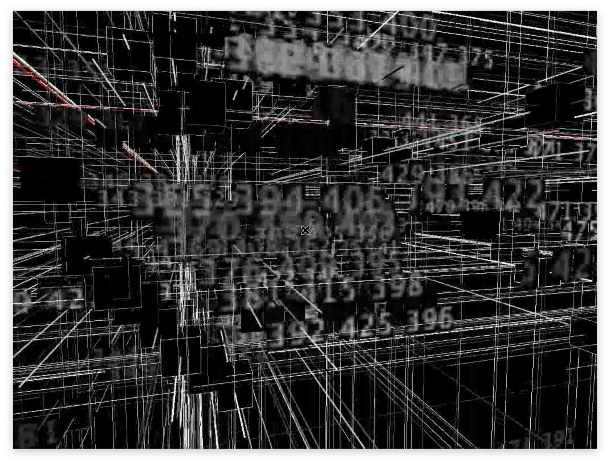

# Video Streaming from Processing
Stream video generated in real-time from a processing sketch

## Build image:
`docker build -t sketchstream .`

## Start a docker Container
`docker run -d --rm --name sketch -p 1935:1935 -p 8080:8080 sketchstream`

## Run video server:
Execute in the docker container: 
`docker exec -it sketch bash`

### Execute sketch
`/processing-3.5.3/processing-java --sketch=/sketch --run &`

### Start video stream
`avconv -codec:a libvorbis -f x11grab -s 1024x768 -i :1  -f flv rtmp://127.0.0.1/live &`

## receive stream
Using VLC or similar: 
`DOCKER_SERVER_IP=127.0.0.1`
connect to  `rtmp://$DOCKER_SERVER_IP/live`

## Screenshot from VLC

## Collaborate
For ideas and suggestions:
- Use github available features.
- Contact me on contact@n2048.com

https://n2048.com/
